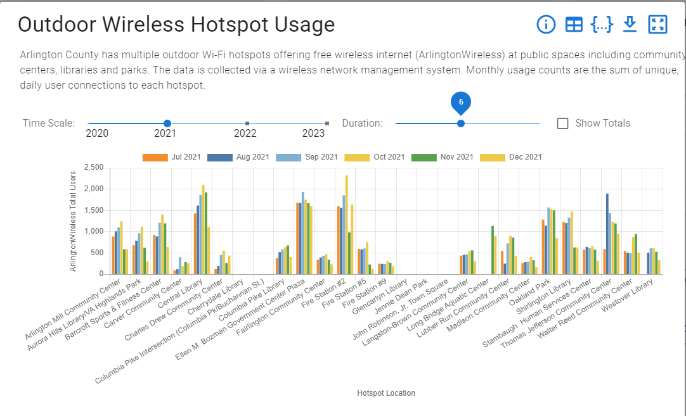
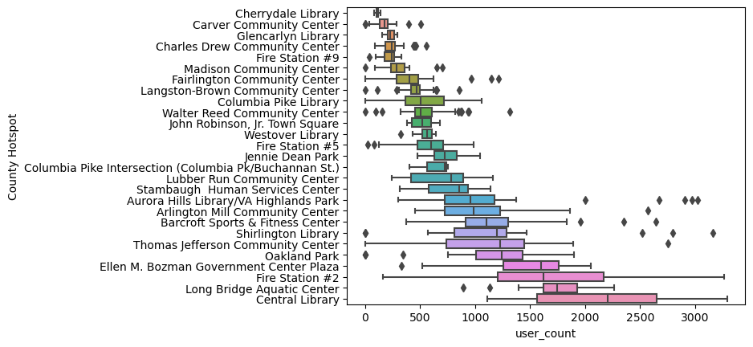

This was a small project I did with data from the the Arlington, VA County [Open Data Portal](https://data.arlingtonva.us/). It was mainly a fun project to illustrate my data visualization skills with some sample wireless access point data (included).

Here is the "before" that's available on the data portal. I was drawn to this one because it is kind of a mix of two comparisons, but mixes them in such a way as to hide all insights from both paradigms (per-site and time series).

Here is my finished product. This does lose the time series aspect of it, but that's also poorly calibrated since it really should be "days-post-install". In the notebook, you can see I attempted that, but it ended up quite underwhelming.

Check out the [notebook](https://github.com/bhollan/arlington/blob/master/Arlington.ipynb) if you're interested!
